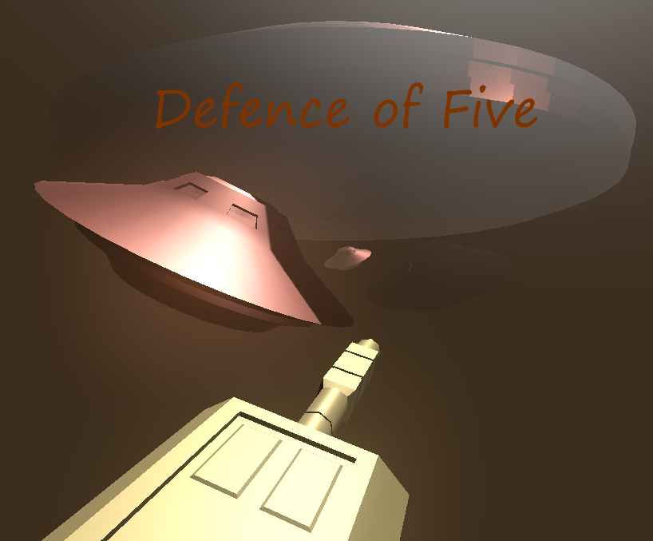

# Defence of Five
PGD JAM #12: "10 mouse clicks"
Additional restriction: Select and use 1 of 3 available color palette, 5 colors each.
F2DA94	- Light Yellow
5E7ECB	- Blue
F39684	- Light Red
BAE6D5	- Cyan
1B1E0D	- Dark

Download from Itch: https://gshadow.itch.io/defence-of-five

**Software used:**
* Blender 3.6
* Godot 4.1.1
* Paint.NET 4.3.7
